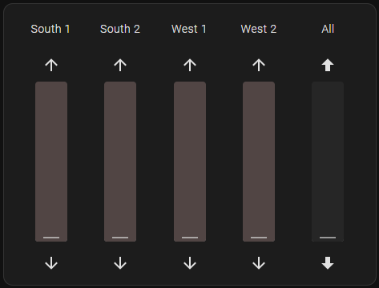
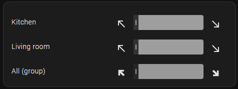

# Cover Slider card for Home Assistant

[](https://github.com/hacs/integration)
[](https://github.com/tolnai/hacs_cover_slider/releases)
[](https://github.com/tolnai/hacs_cover_slider/releases/latest)
[](https://github.com/tolnai/hacs_cover_slider/releases/latest)

This is a custom card loaded via [HACS](https://hacs.xyz) into Home Assistant, which shows sliders for cover type entities. Sliders can go both vertically and horizontally.

The card has a visual editor, but all configuration options are detailed below.

## Samples






## Options

| Name              | Type    | Default          | Description                                                      |
| ----------------- | ------- | ---------------- | ---------------------------------------------------------------- |
| type              | string  | **Required**     | `custom:cover-slider-card`                                       |
| entities          | array   | **Required**     | Entities configured as below                                     |
| direction         | string  | `vertical`       | Slider direction: `vertical`, `horizontal`, `horizontal-invert`  |
| layout            | string  | `full`           | Layout: `full`, `compact`, `stop`, `minimal`                     |
| hideNames         | boolean | `false`          | Hides names of entities. Not recommended for horizontal sliders. |
| titleSize         | number  | `14`             | Title size in px                                                 |
| sliderWidth       | number  | `40`             | Width of sliders in px                                           |
| sliderHeight      | number  | `200`            | Length of sliders in px                                          |
| step              | number  | `5`              | Default slider step size (you'll get 100/step positions)         |
| openColor         | string  |                  | Default color used for open area                                 |
| closedColor       | string  |                  | Default color used for closed area                               |
| upIcon            | icon    | `mdi:arrow-up`   | Default upper/left icon                                          |
| downIcon          | icon    | `mdi:arrow-down` | Default lower/right icon                                         |
| upLabel           | string  | `Up`             | Default label of upper/left icon                                 |
| downLabel         | string  | `Down`           | Default label of lower/right icon                                |
| tap_action        | action  |                  | Default tap action                                               |
| hold_action       | action  |                  | Default hold action                                              |
| double_tap_action | action  |                  | Default default tap action                                       |

The meaning of layouts:

- `full`: Full (all buttons)
- `compact`: Compact (stop appears during movement)
- `stop`: Stop (only Stop button)
- `minimal`: Minimal (no buttons, only slider)

Some options can be set on a global level (defaults), but can be overridden on an entity level.

This card supports actions, which can be triggered by tapping on the cover names, with the usual home assistant type of configuration. These can also be set on a global and entity level as well.

## Entity options

| Name              | Type    | Default          | Description                                      |
| ----------------- | ------- | ---------------- | ------------------------------------------------ |
| entity            | entity  | **Required**     | Cover entity                                     |
| name              | string  | entity's name    | Show this name instead entity's name             |
| invert            | boolean | `false`          | Inverts 0/100 position values                    |
| step              | number  | `5`              | Slider step size (you'll get 100/step positions) |
| openColor         | string  |                  | Individual color used for open area              |
| closedColor       | string  |                  | Individual color used for closed area            |
| upIcon            | icon    | `mdi:arrow-up`   | Individual upper/left icon                       |
| downIcon          | icon    | `mdi:arrow-down` | Individual lower/right icon                      |
| upLabel           | string  | `Up`             | Individual label of upper/left icon              |
| downLabel         | string  | `Down`           | Individual label of lower/right icon             |
| tap_action        | action  |                  | Tap action                                       |
| hold_action       | action  |                  | Hold action                                      |
| double_tap_action | action  |                  | Default tap action                               |

## Installation

Prefered method of installation is [Home Assistant Community Store](https://github.com/hacs/integration).

- Open HACS in Home Assistant, Click the "..." menu, Custom repositories
- Cope the URL of this repo (<https://github.com/tolnai/hacs_cover_slider>) and press Add
- Search for "cover slider", pick "Cover Slider card" from the list, press Download
- After reloading the page, the card will be available in the card picker

## Examples

### Basic example

```yaml
type: custom:cover-slider-card
entities:
  - entity: cover.cover_1
  - entity: cover.cover_2
  - entity: cover.cover_3
  - entity: cover.cover_4
```

### Horizontal example

```yaml
type: custom:cover-slider-card
entities:
  - entity: cover.shade_1
    name: 'Kitchen'
  - entity: cover.shade_2
    name: 'Living room'
direction: horizontal-invert
layout: compact
step: 5
upIcon: mdi:arrow-collapse-horizontal
downIcon: mdi:arrow-expand-horizontal
upLabel: In
downLabel: Out
```

### Full example

```yaml
type: custom:cover-slider-card
entities:
  - entity: cover.cover_1
    name: 'South 1'
    invert: True
    step: 10
  - entity: cover.cover_2
    name: 'South 2'
    invert: True
    step: 10
  - entity: cover.cover_3
    name: 'West 1'
  - entity: cover.cover_4
    name: 'West 2'
  - entity: cover.covers_group
    name: 'All'
    openColor: ''
    closedColor: hsl(200, 20%, 20%)
    upIcon: mdi:arrow-up-bold
    downIcon: mdi:arrow-down-bold
    upLabel: All up
    downLabel: All down
direction: vertical
layout: full
hideNames: false
sliderWidth: 40
sliderHeight: 200
step: 5
openColor: ''
closedColor: ''
upIcon: mdi-arrow-left
downIcon: mdi:arrow-right
```

## Credits

Inspired by:

- [Vertical Slider Cover Card](https://github.com/konnectedvn/lovelace-vertical-slider-cover-card) by [konnectedvn](https://github.com/konnectedvn).
- More modern repo structure of [clock-weather-card](https://github.com/pkissling/clock-weather-card) by [pkissling](https://github.com/pkissling)
