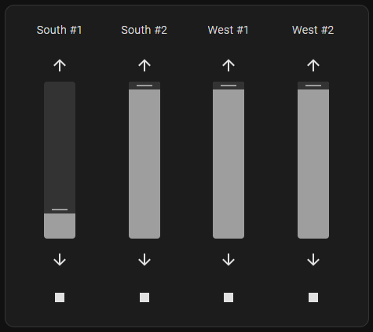

# Cover Slider card for Home Assistant

This is a custom card loaded via HACS into Home Assistant, which shows sliders for cover type entities.

The card has a visual editor, but all configuration options are detailed below.

## Samples



## Options

| Name           | Type    | Default      | Description                  |
| -------------- | ------- | ------------ | ---------------------------- |
| type           | string  | **Required** | `custom:cover-slider-card`   |
| entities       | array   | **Required** | Entities configured as below |
| hideNames      | boolean | false        | Hides names of entities      |
| hideDirections | boolean | false        | Hides up/down buttons        |
| hideStop       | boolean | false        | Hides stop button            |
| sliderWidth    | number  | 40           | Width of slider in px        |
| sliderHeight   | number  | 200          | Height of sliders in px      |

## Entity options

| Name   | Type   | Default       | Description                                                             |
| ------ | ------ | ------------- | ----------------------------------------------------------------------- |
| entity | entity | **Required**  | Cover entity                                                            |
| name   | string | entity's name | Show this name instead entity's name                                    |
| step   | number | 5             | Slider step (with 5, position can be set in 5 increments between 0-100) |

## Installation

Prefered method of installation is [Home Assistant Community Store](https://github.com/hacs/integration).

- Open HACS in Home Assistant, Click the "..." menu, Custom repositories
- Cope the URL of this repo (<https://github.com/tolnai/hacs_cover_slider>) and press Add
- After reloading the page, the card will be available in the card picker

## Examples

### Basic

```yaml
type: custom:cover-slider-card
entities:
  - entity: cover.cover_1
  - entity: cover.cover_2
  - entity: cover.cover_3
  - entity: cover.cover_4
```

### Full

```yaml
type: custom:cover-slider-card
entities:
  - entity: cover.cover_1
    name: 'South #1'
    step: 10
  - entity: cover.cover_2
    name: 'South #2'
    step: 10
  - entity: cover.cover_3
    name: 'West #1'
    step: 10
  - entity: cover.cover_4
    name: 'West #2'
    step: 10
hideNames: false
hideDirections: false
hideStop: false
sliderWidth: 40
sliderHeight: 200
```

## Credits

Inspired by [Vertical Slider Cover Card](https://github.com/konnectedvn/lovelace-vertical-slider-cover-card) by [konnectedvn](https://github.com/konnectedvn).
